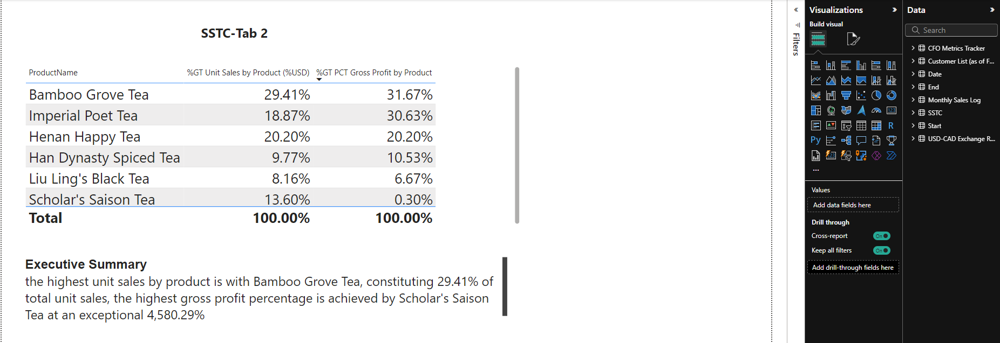
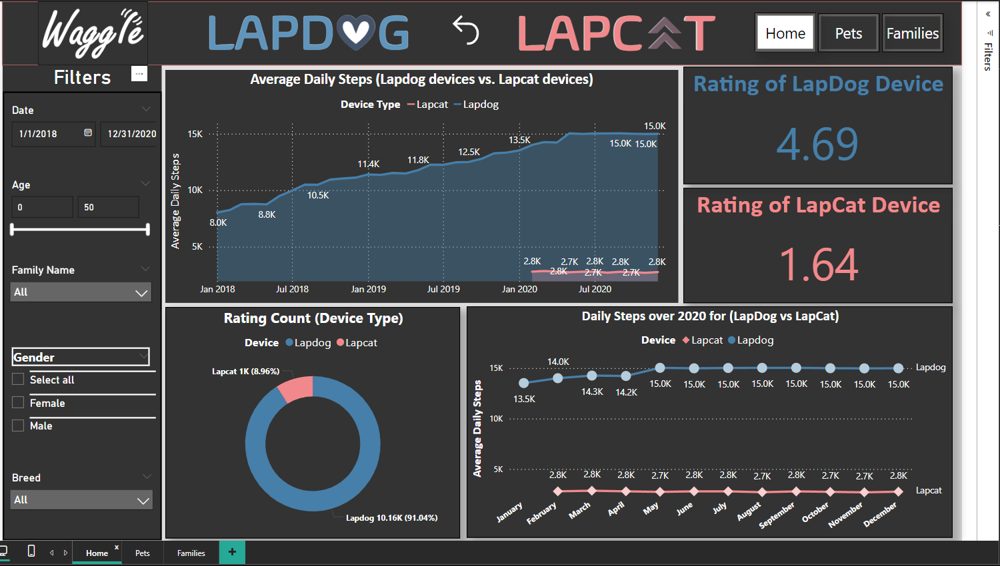
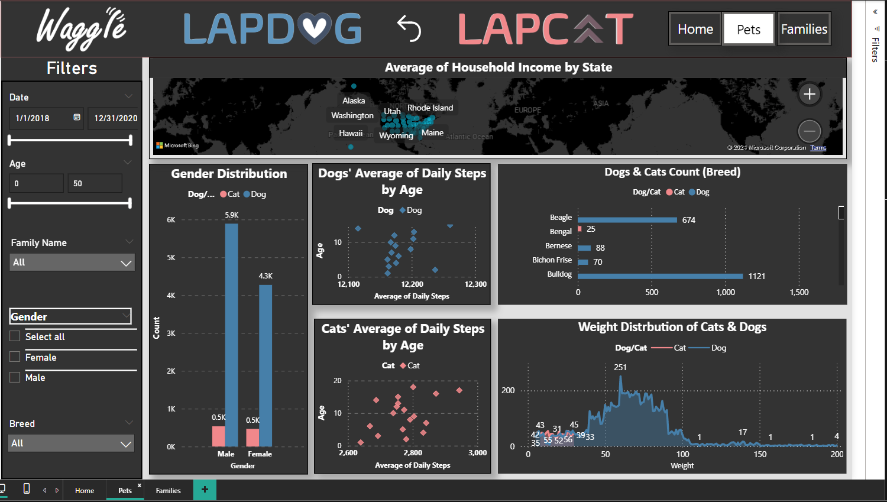
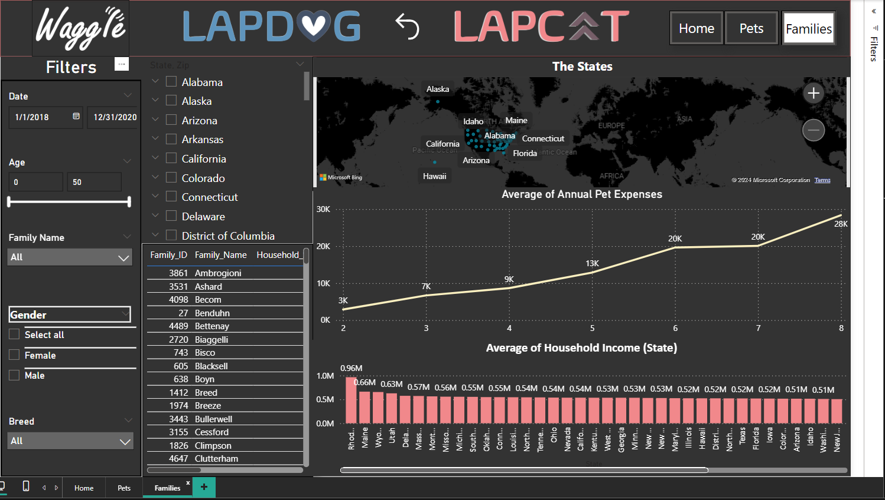
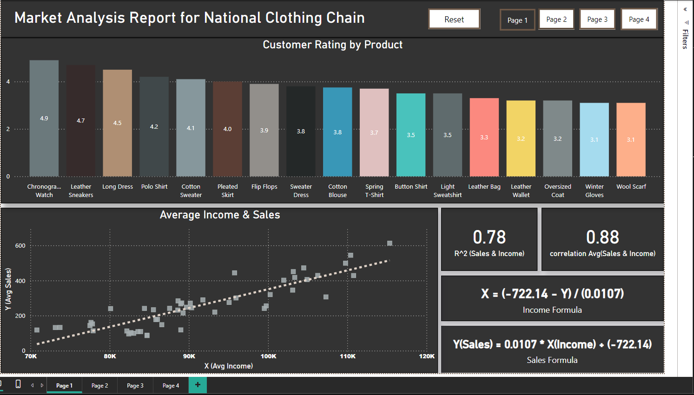
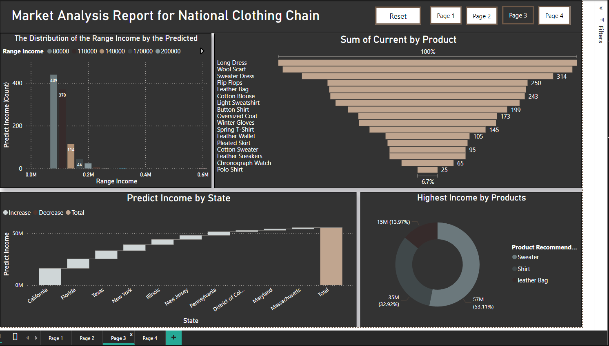
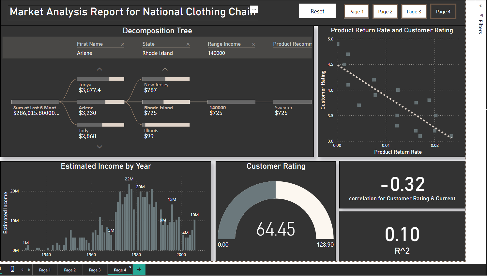

# Nanodegree in Data Analysis and Visualization with Power BI

## Table of Contents
- [Overview](#overview)
- [Skills Developed](#skills-developed)
- [Projects](#projects)
  - [Seven Sages Tea Company](#seven-sages-tea-company)
  - [Waggle Pet Device Analysis](#waggle-pet-device-analysis)
  - [National Clothing Chain Market Analysis](#national-clothing-chain-market-analysis)
- [Repository Structure](#repository-structure)
- [Viewing the Reports](#viewing-the-reports)
- [Conclusions](#conclusions)

## Overview
Throughout this journey, I've honed crucial skills in data preparation, modeling, advanced analytics, interactive visualizations, and professional reporting within Power BI. This repository documents the projects I developed as part of the Udacity Nanodegree program, showcasing my ability to leverage data for insightful decision-making and strategic business recommendations.

## Skills Developed
- **Data Preparation and Modeling**: Mastered cleaning, reshaping, and integrating multiple data sources using Power BI’s ETL capabilities (Power Query) to establish robust data models.
- **DAX Expertise**: Proficient in writing DAX formulas for calculated columns and measures, enhancing data analysis and reporting functionalities.
- **Interactive Visualizations**: Designed engaging, user-friendly reports with various visualization types like bar charts, line graphs, and scatter plots, utilizing interactive elements to facilitate comprehensive data exploration.
- **Advanced Data Analytics**: Applied statistical analysis techniques, including descriptive and inferential statistics, linear regression, and correlation analyses. Enhanced data transformation capabilities using Power Query’s M language.
- **Report Design**: Implemented key design principles to improve usability, making the insights accessible to all levels of business users, aiding in informed decision-making.

## Projects
1. **Seven Sages Tea Company**
   - ### Project Overview
The Seven Sages Tea Company project involved creating a comprehensive data model in Power BI to analyze sales and profitability across different customer segments and product lines. The insights from this project helped the CFO make informed decisions about pricing strategies and product promotions.

### Results
- **Distributor Sales and Profit Margins**: Distributors accounted for the highest sales, totaling $94,436.00 USD with varying profit margins. Rainier & Co. led the way with sales amounting to $41,760.00 USD and the highest gross profit margins at 60.82%.
- **Restaurant Performance**: Restaurants, though fewer in number, showcased remarkable gross profit margins, particularly in cash purchases, highlighting areas with potential for profitability enhancement.
- **Grocery Store Analysis**: The analysis across grocery stores showed consistent sales with Black Bear Market leading in profitability.

2. **Waggle Pet Device Analysis**
   - ### Project Overview
In the Waggle Pet Device project, I developed a Power BI report to compare performance metrics between two pet monitoring devices. The analysis focused on customer satisfaction and product usability, offering critical insights into product development and marketing strategies, with created detailed reports comparing field test data between Lapcat and Lapdog devices.

### Results
- **Device Performance Comparison**: Lapdog devices significantly outperformed Lapcat devices in terms of average daily steps, demonstrating higher customer satisfaction.
- **Demographic Insights**: Detailed analysis on pet demographics, highlighting differences in daily activities between cats and dogs across various ages and breeds.
- **Household Income Analysis**: Explored the correlation between household income and pet expenses, providing valuable insights for targeted marketing strategies.

3. **National Clothing Chain Market Analysis**
   - ### Project Overview
This project entailed performing a detailed market analysis for a National Clothing Chain using Power BI. The aim was to enhance targeted marketing and reconnect with lost customers through predictive analytics and customer segmentation, with compiled a market analysis report that helped the marketing team to target potential and lost customers effectively, using data-driven strategies to optimize the brand’s market presence.

### Results
- **Customer Purchasing Behavior**: Analyzed customer ratings across various product categories, identifying key trends and preferences that can guide inventory and promotional strategies.
- **Income and Sales Correlation**: Explored the relationship between customer income levels and sales, providing insights into pricing strategies and customer spending behavior.
- **Predictive Analysis**: Used historical data to predict future income and product preferences, aiding in strategic planning and resource allocation.

## Repository Structure
Each project folder contains:
- Power BI `.pbix` files: Complete reports with embedded data models and visualizations.
- Data folders: Sample datasets used for each project.
- Documentation: Project overviews and summaries detailing the objectives, methodologies, and insights.

## Viewing the Reports
To view the reports:
1. Download the `.pbix` files.
2. Open them with Microsoft Power BI Desktop.
3. Explore the interactive reports to understand the data stories being told.

## Conclusions
This repository not only reflects the technical skills in Power BI and data analytics but also emphasizes my approach to solving real-world business challenges through data-driven decision-making.
